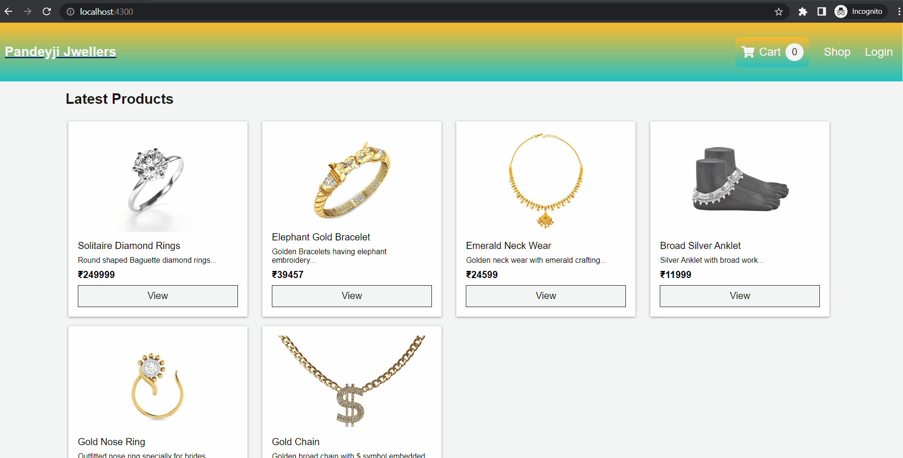

# Jwellery e-commerce-store

## Author: Sangam Pandey

 ## Prerequisites
   
 - Node.js
 - MongoDb
 - npm

 ## Technologies Used

 **Backend:Node.js**
 
 **Frontend:React Js**

 **Database:Mongo Db**

 

 ## Step to Start Project
 

 
**For Backend**
 1. `git clone https://github.com/sangam156s/jwellery-e-commerce.git`
 2. `cd jwellery-backend`
 3. `yarn`
 4. `yarn data:import`
 5. `yarn dev`

**For Frontend**

 1. `cd jwellery-frontend`
 2. `yarn`
 3. `yarn start`

#### If you like project then feel free to give Star 😅

## Demo

